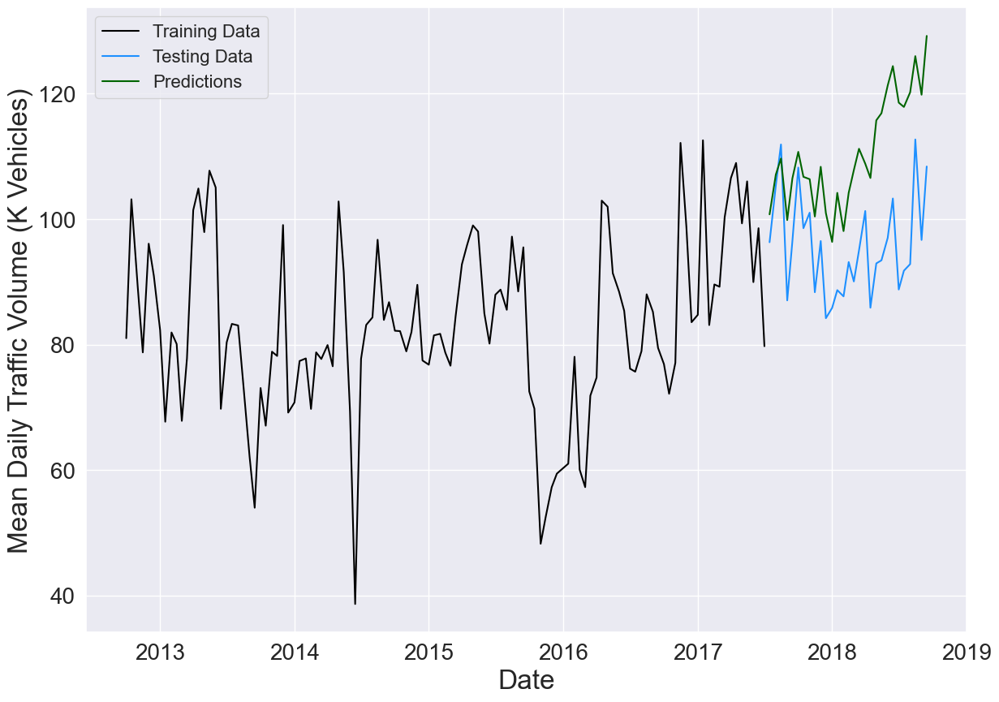

# I-94 Traffic Volume Predictions


## Author
[Paul Schulken](https://github.com/pschulk/)

## Project Overview

This project is intended to provide the Minnesota Department of Transportation (MNDOT) with information and recommendations about what factors lead to heavy traffic volume and if anything can be done along I-94 to mitigate these factors.

My analysis determined that percent cloud cover was the most important factor in terms of predicting traffic volume. I found that for every one percent increase in cloud cover, the traffic volume increased by 380 vehicles. This may not sound like much but if heavy clouds or a storm rolls in and increases cloud cover by 25%, there will be a corresponding increase of 9500 vehicles. Lastly, after incorporating holidays, I saw that the Minnesota State Fair is the only holiday that produces above average traffic volume. This isn't too surprising since the Minnesota State Fair is the largest fair in the country in terms of daily attendance.

## Data Overview

The [dataset](https://archive.ics.uci.edu/ml/datasets/Metro+Interstate+Traffic+Volume#) used for analysis contained hourly I-94 Westbound traffic volume as well as hourly weather data and the presence of holidays. There were just over 48,000 entries ranging from October 2012 to September 2018. The traffic volume was sourced from Minnesota DOT Automatic Traffic Recorder Station #301. The weather data was provided by [OpenWeatherMap](https://openweathermap.org/). The dataset did NOT include whether or not an accident had occured during the hour and it required some modification to get a completely sequential time series.

## Data Cleaning & Preparation

The first step I took was downsampling the data from hourly to daily values and, upon checking the results, found some days that did not have a complete 24 hours of data as well as some days that didn't have any data. To fix this, I calculated the average traffic volume for the complete days and replaced the incomplete values with these averages. I also obtained a dataset from the [National Oceanic and Atmospheric Association's](https://www.ncdc.noaa.gov/cdo-web/datasets/GHCND/stations/GHCND:USW00014922/detail) weather station located at the Minneapolis - St. Paul airport and used their temperature and precipitation values.

Once I had a complete daily time series, I performed some visualization and saw that traffic tends to increase slightly each weekday before dropping off on the weekends. As I mentioned earlier, the State Fair is the only holiday to produce above average traffic volume.


## Modeling & Evaluation

I decided to use the [Prophet](https://facebook.github.io/prophet/) modeling system, which is open-source software developed by Facebook's Core Data Science team and can be used for general forecasting purposes. It can be fit with various seasonality and holiday effects in addition to recognizing outliers within the data. It also contains parameters that can be tweaked for whatever is being forecast. These built-in capabilities seemed like the best fit for my needs.

After iterating through several different models where I added the weather data, holidays, and weekly seasonality, I built my final model on part of the dataset before comparing the predictions to the rest of the data. The model performs well for the first 6-8 months but tends to overestimate the traffic volume beyond that, with an average error just under 22,800 vehicles. The model does reflect the peaks and valleys of the testing data.



Next, I trained my final model on the entire dataset and used that to predict the next two years of traffic data. In order to use multiple variables to predict future values, Prophet requires data for each of those variables for the desired future prediction dates. I once again used NOAA data to fill out the temperature and precipitation values then created a separate model to generate future percent cloud cover data. The end result are these predicted traffic values for October 2018 through September 2020, which show that traffic volume decreases as the cold Minnesota winter approaches and increases again when the weather improves.


## Conclusion & Recommendations

As important as it is to verify visual data with hard modeling, the opposite can also be true. Throughout the modeling process, I found that percent cloud cover was the most important predictive factor and decided to plot it against traffic volume. From the graph, we can indeed see that traffic volume, on average, increases with almost every single increase in percent cloud cover.


Due to the fact that traffic volume tends to increase as general visiblity decreases, I recommend installing lighting systems along any stretch of I-94 that doesn't currently have it. In addition, I recommend regular inspection of reflectors, pavement markings, and signage to ensure reflectivity. Lastly, I recommend the promotion of alternate transporation options for high-volume events like the State Fair. There is a park-and-ride system in place already, but this could be incentivized through things like discounted fair tickets or food vouchers for public transit users.

## Future Insights & Next Steps

To improve upon this process in the future, I could incorporate additional data like the presence of collisions and scrape actual traffic volume or cloud cover data to fill in any gaps. Also, the Prophet model allows for expansion of holidays beyond just one day, so I could include the day before Thanksgiving and the period between Christmas and New Year's as these tend to be big travel days.

## For More Information

<<<<<<< HEAD
Please review my full analysis in my [Jupyter notebook](./I-94_Traffic_Volume_Analysis_&_Predictions.ipynb) or my [presentation](./I-94 Traffic Volume Analysis & Predictions.pdf).
=======
Please review my full analysis in my [Jupyter notebook](./Final_Notebook.ipynb) or my [presentation](./presentation.pdf).
>>>>>>> 99d373f9795c4b253ad8b54db9dcddb8da0284cb

## Repository Structure

```
<<<<<<< HEAD
├── data                                                    <- Jupyter notebooks for data exploration and testing
├── exploratory_files                                       <- Both sourced externally and generated from code
├── images                                                  <- Data files used in analysis
├── .gitignore                                              <- Code to avoid uploading specified files
├── I-94_Traffic_Volume_Analysis_&_Predictions.ipynb        <- Narrative documentation of analysis in Jupyter notebook
├── README.md                                               <- The top-level README for reviewers of this project
├── I-94 Traffic Volume Analysis & Predictions.pdf          <- PDF version of project presentation
```
=======
├── data                                <- Jupyter notebooks for data exploration and testing
├── exploratory_files                   <- Both sourced externally and generated from code
├── images                              <- Data files used in analysis
├── .gitignore                          <- Code to avoid uploading specified files
├── Final_Notebook.ipynb                <- Narrative documentation of analysis in Jupyter notebook
├── README.md                           <- The top-level README for reviewers of this project
├── presentation.pdf                    <- PDF version of project presentation
```
>>>>>>> 99d373f9795c4b253ad8b54db9dcddb8da0284cb
